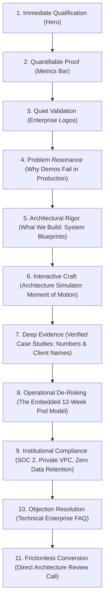

# Information Architecture & Section Hierarchy: Trao.ai Rebuild

---

## 1. Executive Philosophy: The 60-Second Enterprise Decision Loop

Enterprise buyers (CTOs, COOs, VPs of Transformation at $10M–$1B+ companies) do not browse websites; **they audit them to disqualify vendors**. They have sat through a dozen generic AI demos this quarter. They arrive with deep skepticism and one decisive question:

> *"Can this team be trusted with mission-critical systems that matter to our business?"*

### The Narrative Architecture
To convert this buyer, the page is structured around a **tight logical proof progression**:

---

## 2. Section-by-Section Architectural Hierarchy

### Section 01: Top Navigation Bar
* **Visual Density:** Slim (64px height), persistent sticky header with subtle backdrop blur (`rgba(250, 249, 245, 0.85)`).
* **Information Hierarchy:**
  1. *Brand Identifier:* Trao wordmark + subtle micro-tag `[Embedded AI Systems]`.
  2. *Navigation Anchors:* Capabilities • Case Studies • Methodology • Security • FAQ.
  3. *Live Production Status Indicator:* Small green pulsing node `● Production Systems Live`.
  4. *Direct Action:* Primary button `Book Architecture Review →`.
* **Enterprise Psychology:** Confirms legitimacy immediately; provides single clear exit action at any scroll position.

---

### Section 02: Hero Section (The 15-Second Trust Test)
* **Frame:** Full viewport above the fold on desktop (1440px).
* **Grid:** 12-column asymmetric layout with restrained editorial framing.
* **Information Hierarchy:**
  1. *Eyebrow Tag:* `EMBEDDED AI SYSTEMS ENGINEERING` (Monospace, uppercase, dark green accent).
  2. *Primary Headline:* **"We engineer AI systems that survive contact with production."**
  3. *Supporting Statement:* Explicitly explains the embedded model: researching broken workflows, placing senior engineers inside the client team, building production software holding up at 3:00 AM on a Tuesday.
  4. *Action Cluster:*
     * Primary Button: `Book an Architecture Review →`
     * Secondary Anchor: `Inspect Deployed Systems ↓`
  5. *Assurance Badges:* Clean horizontal row: `No Vendor Lock-in` | `Deploy in Your VPC` | `SOC 2 Type II Certified` | `Zero Training on Your IP`.
* **Why It Earns Its Place:** Disqualifies the notion of Trao as an offshore dev shop or agency; establishes Trao as a high-caliber embedded R&D partner.

---

### Section 03: Verifiable Proof Bar (The Quantitative Metric Row)
* **Layout:** 4-column structured grid divided by hairline border dividers (`#E1DACD`).
* **Information Hierarchy:**
  * **Metric 01:** `3 Weeks → 45 Min` (Manufacturing turnaround engineered for Vlon).
  * **Metric 02:** `$50M+` (Direct operational value unlocked for enterprise clients).
  * **Metric 03:** `100%` (Client IP & code ownership deployed inside private VPCs).
  * **Metric 04:** `99.98%` (Production uptime across automated mission-critical workflows).
* **Why It Earns Its Place:** Cautious buyers require concrete claims. Real numbers invite scrutiny and establish authority before the user even scrolls past the fold.

---

### Section 04: Institutional Logo Wall (Quiet Validation)
* **Layout:** Restrained monochrome/greyscale logo grid with subtle hover transitions.
* **Logos Included:** Commonwealth Bank (CommBank), Vlon, Oply, Avencera, Second Sense, EHS, Exmplit.
* **Sub-text:** *"Running in production across banking, high-frequency logistics, regulated manufacturing, and enterprise SaaS."*
* **Why It Earns Its Place:** Regulated enterprises look for peer validation. Seeing CommBank and enterprise manufacturers immediately signals compliance maturity.

---

### Section 05: The Production Reality (Why Traditional AI Vendors Fail)
* **Layout:** 2-column comparative layout (Problem vs. Trao Engineered Solution).
* **Core Contrast:**
  * *Column A (The Industry Failure):* Brittle prompt chains, security leakage via public APIs, and abandonware prototypes left by management consultancies.
  * *Column B (The Trao Architectural Response):* Deterministic state machines, private VPC air-gapped endpoints, and embedded engineering pods that write code directly in the client repo.
* **Why It Earns Its Place:** It articulates the exact pain point enterprise CTOs have experienced with their last three failed AI vendor pilots.

---

### Section 06: Core System Capabilities (Architectural Blueprints)
* **Layout:** 2x2 modular technical grid.
* **Information Hierarchy (4 System Blueprints):**
  1. **Autonomous Multi-Agent Orchestration:** Complex stateful workflows replacing manual multi-stage operations.
  2. **High-Volume Unstructured Document Extraction:** Zero-loss parsing from messy enterprise PDFs and technical drawings.
  3. **Enterprise Knowledge Intelligence & Private RAG:** Deterministic citation-backed question-answering over proprietary enterprise silos.
  4. **Core System Re-engineering:** Full rebuild of legacy manual internal portals into intent-driven AI engines.
* **Why It Earns Its Place:** Moves away from vague marketing services to concrete technical capabilities that engineering leaders recognize and budget for.

---

### Section 07: Interactive Architecture Simulator (The Moment of Motion)
* **Placement:** Immediately following Capabilities.
* **Concept:** An interactive architectural state-machine visualizer demonstrating how Trao's production agent pipelines handle messy real-world data vs. falling back safely.
* **Interactive Controls:**
  * Mode 1: *Unstructured Input Ingestion* (Shows schema normalization).
  * Mode 2: *Confidence Scoring & Multi-Agent Verification* (Shows deterministic gatekeeping).
  * Mode 3: *Audited Fallback & Human-in-the-Loop* (Shows safety triggers).
* **Why It Earns Its Place:** Fulfills the brief's requirement for *"one moment of motion or interaction"* while directly serving the enterprise argument: proving that Trao builds reliable, fail-safe systems.

---

### Section 08: Deep Evidence of Production Work (Case Studies)
* **Layout:** Two extensive, high-contrast case study dossiers with before/after architecture diagrams and named quotes.
* **Dossier 01: Vlon Textile Manufacturing**
  * *Context:* 3-week design-to-production bottleneck.
  * *Engineering:* Automated vision-and-rendering pipeline with yarn tension calculations and dye separation automation.
  * *Outcome:* Cut turnaround to 45 minutes; 84% factory rework reduction.
  * *Quote:* Sri Kansal (CEO).
* **Dossier 02: Oply Global Recruitment Logistics**
  * *Context:* 25,000 monthly resumes, 120-hour backlog.
  * *Engineering:* Multi-agent credential parsing, stack mapping, and candidate brief synthesis.
  * *Outcome:* 92% processing time reduction; 4x hiring throughput.
  * *Quote:* John Pettman (Co-Founder).
* **Why It Earns Its Place:** Enterprise buyers do not buy promises; they buy proven outcomes. Named clients with verified operational transformations convert skeptical boards.

---

### Section 09: The Embedded Model (Operational De-Risking)
* **Layout:** 4-stage horizontal sprint progression (Weeks 1 to 12).
* **Stages:**
  1. *Weeks 1–2:* Deep Process Forensic & Architectural Blueprint.
  2. *Weeks 3–6:* Embedded Pod Integration (Directly inside client Slack/Git/Jira).
  3. *Weeks 7–10:* Production Hardening, Latency Optimization & Security Audit.
  4. *Weeks 11–12:* Live VPC Rollout, Team Handover & 90-Day Hypercare.
* **Why It Earns Its Place:** Answers the COO’s primary objection: *"How does this actually work without disrupting our current engineering roadmap?"*

---

### Section 10: Institutional Security, Governance & IP Ownership
* **Layout:** 4-card high-trust grid.
* **Items:**
  1. *SOC 2 Type II Certified & GDPR Compliant* (Audited encryption, access controls).
  2. *100% Client IP & Code Ownership* (All commits made to client Git repositories).
  3. *Zero Data Retention Guarantee* (Your data never trains public frontier models).
  4. *Private VPC & On-Premises Ready* (AWS, GCP, Azure, or air-gapped clusters).
* **Why It Earns Its Place:** This is the section the CTO forwards to their InfoSec team and General Counsel to get procurement pre-approval.

---

### Section 11: Enterprise Technical FAQ (The Pre-emptive Defense)
* **Layout:** Clean accordion system with generous whitespace.
* **Topics Addressed:**
  * Hallucination prevention and deterministic fallbacks.
  * Data residency and VPC isolation.
  * Differentiation from standard IT consultancies.
  * Integrating with legacy ERPs (SAP, Salesforce, AS400).
  * Post-launch maintenance and code ownership.
* **Why It Earns Its Place:** Neutralizes the last remaining objections before the buyer books the call.

---

### Section 12: Final Conversion Action (Book Architecture Review)
* **Layout:** Centered, dignified conversion block with clean borders.
* **Headline:** *"Book a 30-Minute Architecture Review with an Engineering Lead."*
* **Body:** Reassures the buyer: No junior BDRs, no high-pressure sales pitch. An honest technical feasibility review.
* **Primary Button:** `Schedule Architecture Review →`
* **Direct Channel:** `talent@trao.ai`
* **Trust Badges:** `Mutual NDA Executed First` • `Direct Architect Access` • `Feasibility Assessment in 48 Hours`.

---

### Section 13: Enterprise Footer
* **Layout:** 4-column structured footer with formal LLP entity disclosures.
* **Contents:** System capability links, security and trust links, office locations (San Jose, London, Bangalore), copyright, and LLP registration number (`LLPIN ACR-4080`).

---

## 3. What Was Cut From the Current Site & Why

| Cut Element | Why It Was Cut |
| :--- | :--- |
| **"Typical AI SaaS projects start from £25,000"** | **Destroys Enterprise Credibility.** Disqualifies Trao from \$50M+ enterprise buyers who equate £25k with low-end freelance work. |
| **"Go-To-Market via Meta Ads & Google Ads"** | **Wrong Category Signal.** Trao is an embedded AI engineering lab, not a digital growth marketing agency. |
| **Floating 4-Button AI Persona Widget** | **Distracting Gimmick.** Feels like a cheap wrapper product demo rather than deep enterprise infrastructure. |
| **"Most MVPs delivered in 8–12 weeks"** | **Wrong Framing.** Enterprises do not buy "MVPs"; they buy hardened, compliant production systems. |
| **Six-font typography soup** | **Aesthetic Immaturity.** Stripped down to two rigorously disciplined type families: a modern technical sans (`Inter` / `Plus Jakarta Sans`) and an authoritative editorial serif (`Newsreader`). |

---

## 4. Responsive Hierarchy: Desktop (1440px) vs. Mobile (390px)

| Component / Section | Desktop (1440px) | Mobile (390px) |
| :--- | :--- | :--- |
| **Navigation** | Full horizontal menu + live status node + CTA button | Trao logo + compact hamburger drawer + sticky bottom CTA |
| **Hero Layout** | Asymmetric 12-col grid with generous whitespace and editorial balance | Single stacked column; tight vertical rhythm (32px margins) |
| **Metrics Bar** | 4 columns in one horizontal line with vertical dividers | 2x2 grid with hairline borders |
| **Logo Wall** | 6 logos across in a single row | 3x2 grid with gentle horizontal scroll or stacked pairs |
| **Capabilities Grid** | 2x2 technical blueprints with interactive hover micro-states | Single vertical stack; tap-to-expand details |
| **Architecture Simulator** | Full canvas with interactive tabs and dynamic flow state | Simplified 3-step vertical card progression with visual states |
| **Case Studies** | Split 2-column dossier (Problem + Architecture Diagram on left, Results + Quote on right) | Full-width vertical cards; metrics prominently showcased at the top |
| **The Embedded Model** | Horizontal 4-step milestone timeline with continuous line | Vertical milestone sequence with left connected rail |
| **Security Grid** | 4-column cards | 2x2 compact card layout |
| **CTA Block** | Large framed editorial block with dual action options | Full-width container with prominent tap-friendly button (min 48px height) |
